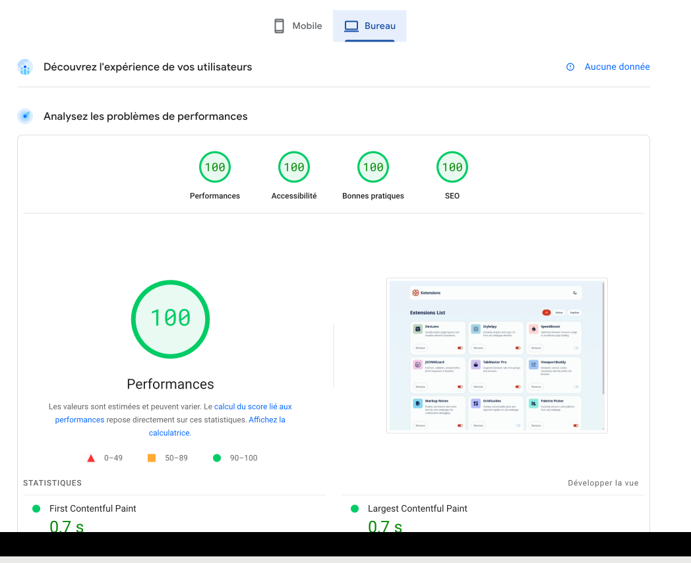
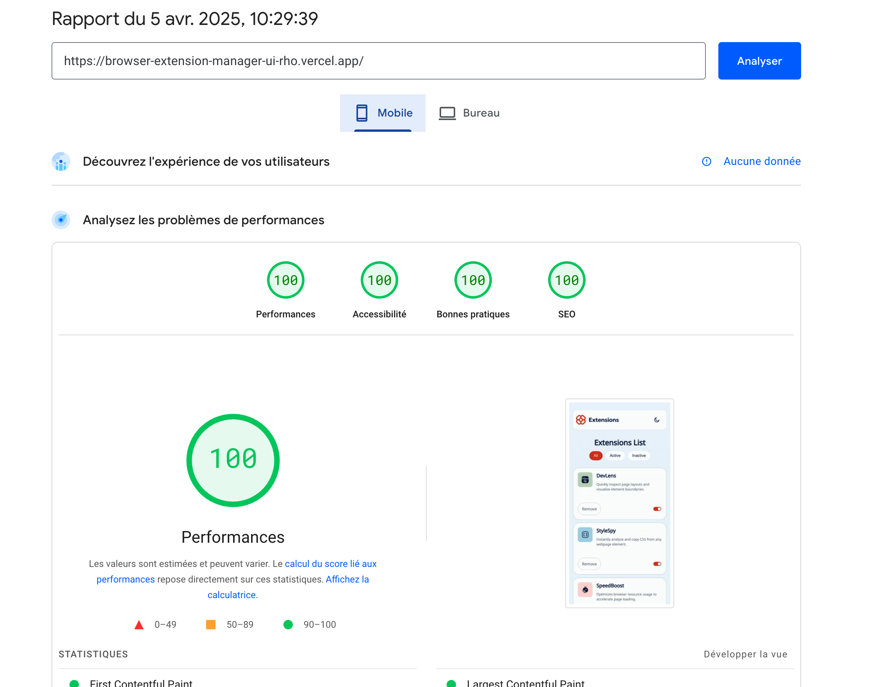

# BROWSER EXTENSION LIST UI

## The project

This a project designed by frontend mentor.

## The stack

- HTML
- CSS
- JavascriptJ'espe
- TailwindCSS
- Vue 3
- Vue-Router 4
- Pinia

## Installation

```
npm install
```

or

```
npm i
```

To launch the app on a local server:

```
npm run dev
```

It will be served on http://localhost:5173/ .

## Performance

### Desktop Performance



### Mobile Performance


